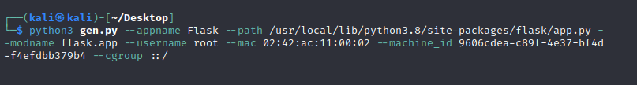

# Раскручиваем некорректное чтение файла до RCE в приложение на Flask

### Что вообще представляет из себя Flask?

__Flask__ - это микрофреймворк для создания веб-приложений на языке Python. Он предоставляет минимальный набор инструментов для создания веб-приложений, но при этом оставляет достаточно свободы для выбора архитектуры и инструментов, которые будут использоваться в проекте.
Пройдемся по каждому значению из наборов, чтобы лучше понимать какие данные нам необходимо будет ввести.
Flask позволяет создавать веб-приложения любой сложности, от простых сайтов до сложных веб-сервисов. Он имеет множество расширений, которые позволяют добавлять дополнительные функциональные возможности, такие как авторизация, обработка форм, работа с базами данных и многое другое.

Одной из главных особенностей Flask является его простота и легковесность. Он не навязывает определенную архитектуру и не требует большого количества настроек, что делает его идеальным выбором для быстрого прототипирования и разработки небольших проектов.

Кроме того, Flask имеет отличную документацию и активное сообщество разработчиков, что делает его очень доступным для изучения и использования.

### Отладка приложений

Отладка приложений на Flask может быть выполнена с помощью встроенного в Flask отладчика, который позволяет отслеживать ошибки и исключения в приложении. Для включения которого, необходимо установить параметр debug=True в объекте приложения Flask. Это позволит отображать подробную информацию об ошибках в браузере.

Когда режим отладки включен, Flask будет выводить подробную информацию об ошибках и исключениях, что может помочь разработчику быстрее и легче находить и исправлять ошибки в приложении. Однако, включение режима отладки на продакшен-сервере может представлять угрозу безопасности, поэтому debug pin обычно используется только во время разработки и тестирования приложения. Данный пин может быть использован разработчиком для выполнения python комманд на сервере, и если забыть его отключить, а потом залить приложение в продакшен на сервер, мы получим уязвимость.

### Как искать такие приложения?

Отличительной чертой приложений на Flask является возможность получения доступа к консоли отладки, что может быть опасно для безопасности приложения, если оно находится в открытом доступе. Также данные приложения с включенным режимом отладки обычно работают на 5000 порту. Консоль отладки в таких приложениях находится по следующему пути: _http(s)://IP/console_

### Запуститм наше веб-приложение

Для того, чтобы приложение встало на вашем компьютере достаточно развернуть докер-контейнер командой:

```
$ sudo docker image build -t flask_docker .
$ sudo docker run -it -p 5000:5000 flask_docker
```

Запускать приложение реомендуется __НЕ__ в фоновом режиме, чтобы можно было увидеть __PIN__ консоли, реализуя уязвимость, нужно будет получить именно его.

### Поговорим о теории

Давайте разберемся как генеруется PIN. Какие у него есть дефолтные значения, а после попробуем уже самостоятельно сгенерировать его.

Первым делом происходит вызов функции _get_pin_and_cookie_name_.

```python
def get_pin_and_cookie_name(
    app: WSGIApplication,
) -> tuple[str, str] | tuple[None, None]:
    pin = os.environ.get("WERKZEUG_DEBUG_PIN")
    rv = None
    num = None

    # Pin was explicitly disabled
    if pin == "off":
        return None, None

    # Pin was provided explicitly
    if pin is not None and pin.replace("-", "").isdecimal():
        # If there are separators in the pin, return it directly
        if "-" in pin:
            rv = pin
        else:
            num = pin
```

В данной функции и происходит процесс генерации имени куки и PIN'а. В процессе генерации ключа участвуют 2 набора байт:

- __Публичный набор__

   Эта информация существует только для того, чтобы сделать файл cookie уникальным на компьютере, а не в качестве функции безопасности.

- __Приватный набор__

    Эта информация предназначена для того, чтобы злоумышленнику было сложнее угадать эти значения. Маловероятно, что они будут содержаться где-либо на неаутентифицированной странице отладки, поэтому для того чтобы их узнать придется потрудится.

__Публичный набор__ состоит из:

1. Username
2. Modname
3. getattr(app, "name", type(app).name)
4. getattr(mod, "file", None)

```python
probably_public_bits = [
        username,
        modname,
        getattr(app, "__name__", type(app).__name__),
        getattr(mod, "__file__", None),
    ]
```

__Приватный набор__ состоит из:

1 MAC адреса интерфейса в десятичной системе
2 machine_id 

```python
private_bits = [str(uuid.getnode()), get_machine_id()]
```

Далее эти два набора байт проходят через цикл и хешируются алгоритмом sha1.

```python
h = hashlib.sha1()
for bit in chain(probably_public_bits, private_bits):
    if not bit:
        continue
    if isinstance(bit, str):
        bit = bit.encode("utf-8")
    h.update(bit)
h.update(b"cookiesalt")

cookie_name = f"__wzd{h.hexdigest()[:20]}"
```

Сразу после этого цикла на основе результата хеширования генерируется имя куки, которое будет присваиваться пользователю после входа в консоль. Важно заметить, что генерируется именно __имя куки, а не значение__. Ее имя будет постоянное, а с генерацией значения мы разберемся чуть позже. Строка, в которой происходит назначение имени куки:

```python
cookie_name = f"__wzd{h.hexdigest()[:20]}"
```
Значения переменной h после хеширования имеет длину 40 16-ых символов, из которых первык 20 берутся как значение имени куки.

Далее идет заключающий цикл, где пину придается окончательный вид.

```python
if rv is None:
    for group_size in 5, 4, 3:
        if len(num) % group_size == 0:
            rv = "-".join(
                num[x : x + group_size].rjust(group_size, "0")
                for x in range(0, len(num), group_size)
            )
            break
    else:
        rv = num

return rv, cookie_name
```

### Пройдемся по каждому значению из наборов, чтобы лучше понимать какие данные нам необходимо будет ввести.

#### Имя пользователя

Имя текущего пользователя можно получить несколькими способами:

1. Чтение файла /proc/self/cgroup
2. Чтение файла /etc/passwd

#### modname

По дефолту стоит <flask.app>, скорее всего менять не придется

```python
 modname = getattr(app, "__module__", t.cast(object, app).__class__.__module__)
    username: str | None

    try:
        # getuser imports the pwd module, which does not exist in Google
        # App Engine. It may also raise a KeyError if the UID does not
        # have a username, such as in Docker.
        username = getpass.getuser()
    except (ImportError, KeyError):
        username = None

    mod = sys.modules.get(modname)
```

#### getattr(app, "name", type(app).name) и getattr(mod, "file", None)

- Стандартное значение содержащее значение Flask
- Путь до flask

```python 
getattr(app, "__name__", type(app).__name__)
getattr(mod, "__file__", None)
```

#### Получение пути до Flask

Путь до приложения Flask можно получить ввестя любой некорректный шаблон или любые некорректные данные в функцию, после которого Flask выдаст вам ошибку, в ней и будет указан путь до flask.

#### MAC или тотже UUID

При получении интерфейса могут возьникнуть небольшие проблеммы, если этих интерфейсов несколько. Тут стоит пропробовать все интерфейсты, которые имеют доступ к интернету. Поэтому если у вас не подходит deubg pin, то попробуйте сменить интерфейс. Список доступных интерйесов вы можете увидеть с помощью чтения файла /proc/net/dev. А вот MAC адрес интерфейста можно увидеть с помощью файла /sys/class/net/INT/address, где INT - любой интерфейс.

#### Machine_id

Этот байт состоит из нескольких частей:

- Полное содержимое файла /etc/machine-id(если он есть, в ином случае /proc/sys/kernel/random/boot_id)

- Часть файла после последнего слеша /proc/self/cgroup

### Генерации куки

Начало генерации куки идет еще с функции ___get_pin_and_cookie_name___, которая в конечном результате возвращает нам значения имени куки, а также пин.

1. Генерация имени куки.

```python
cookie_name = f"__wzd{h.hexdigest()[:20]}"
```
2. Генерация значения куки просходит в фалйе __init__.py и состоит из хеша пина и времени в формате UNIX time.

PIN хешируется алгоритом sha1 в функции hash_pin, но стоит заметить, что хешируется не только PIN, а строка содержащая его: "YOUR PIN added salt".

```python 
def hash_pin(pin: str) -> str:
    return hashlib.sha1(f"{pin} added salt".encode("utf-8", "replace")).hexdigest()[:12]
```

### Генерируем пин и пробуем получить доступ к серверу

Запускаем наш сервер и видим, что в данный момент пином является следующее значение


На данным момент наша задача представить, что мы являемся злоумышленником и попытаться получить доступ к удаленному отладчику для последующего получения доступа к системе. Теперь, имея доступ к чтению файлов на системе, мы сможем самостоятельно сгенерировать пин и получить доступ к отладчику.

В данный момент нам необходимо прочитать череду файлов, для получения нужных значений, используемых в процессе генерации.

### Получаем данные

Всего 6 значений, но некоторые из них имеют стандартные значения, или их очень легко получить.

1. Appname

    getattr(app, "__name__", type(app).__name__), по умолчанию имеет значение Flask

2. PATH

    getattr(mod, "__file__", None), путь до Flask, который мы может легко получить, вызвав любую ошибку, например: в функции чтения файлов вместо ожидаемого на вход файла введем директорию /. В результате получаем ошибку и еще одно значение, которое нам понадобится для дальнейшей генерации пина.

3. Modname

    Modname тоже имеет стандартное значение: flask.app

4. Username

    

5. MAC

    В этом и следующем этапе получение данных не такое простое, их нельзя получить из открытых источников, а так же они обычно всегда уникальные.

    Получение MAC'а делиться на 2 этапа:

    - Получение имени сетевого интерфейса
    

    - Получение MAC'а для данного интерфейса
    

6. Machine_id

    Последняя часть, необходимая для генерации пина это machine_id

    Его получение так же делится на 2 этапа:

    - Прочитать файл /etc/machine_id

    - Прочитать файл /proc/self/cgroup

Теперь нам остется только подствить данные значения в скрипт и сгенерировать этот пин. Скрипт предлагается написать читателю




Пин, который выдал сервер разработчику и наш сгенерированный пин одинаковые, а это значит, что теперь мы можем получить доступ к отладочной консоли и выполнить произвольный код! Как говорилось ранее, обычно консоль находится по адресу: http://127.0.0.1:5000/console и при входе в консоль нас встречает окошко с просьбой ввести PIN. После ввода которого мы и получим выполнение произвольного кода.

### Пример исполнения команд с помощью среды python:

Исполним следующее выражение, где вместо CMD может быть любая команда:
```python
a = import('os').popen('CMD').read().split('\n')[:-1]; print(*a)
```


Команды на сервере успешно выполняются! А это значит, что мы из чтения файлов получили полноценный удаленный доступ к системе.

### Избегаем заблокированной консоли

Но если попыток неправльного входа будет слишком много, консоль заблокируется. Чтобы обойти это мы должны использовать ранее сгенерированную куку. Также нужно изменить параметр &pin=... на &frm=0. После этого мы сможем успешно выполнить код.